# Calibra — Reglas de negocio y modelo de dominio

Documento de traspaso para la sesión que construirá el backlog y las historias de usuario.

- **Fecha de las decisiones:** 28 de septiembre de 2026 (sesión de modelado de una tarde).
- **Versión del modelo:** v10 (final de esta sesión).
- **Archivos hermanos:** `calibra.puml` (fuente del diagrama, idéntica a la sección 11) y `calibra.png` (render).
- **Idioma del producto:** español. **Zona horaria:** America/Bogotá (UTC-5, sin horario de verano). **Moneda:** COP.

---

## 0. Cómo usar este documento

### Qué se espera de la sesión que lo lea

1. Proponer **épicas** y **historias de usuario** con el formato "Como `<actor>` quiero `<capacidad>` para `<beneficio>`".
2. Escribir **criterios de aceptación** en formato Dado/Cuando/Entonces, incluyendo los casos límite de plazos (sección 6).
3. Referenciar cada historia con los identificadores de reglas (`RN-xx`) que implementa, para trazabilidad.
4. Listar **tareas técnicas** que no son historias de usuario: procesos programados (sección 6.2), migraciones, políticas de acceso, almacenamiento de archivos.
5. Proponer **priorización** (por ejemplo, MoSCoW) y un **corte de MVP**. Ver la advertencia de alcance en la sección 1.
6. **No inventar reglas.** Si falta un dato, agregarlo a una lista de preguntas abiertas. La sección 13 ya recoge las que conocemos.

### Convención de etiquetas

| Etiqueta | Significado |
|---|---|
| **[D]** | Decidido explícitamente por el equipo durante la sesión. |
| **[S]** | Supuesto: lo propuso Claude durante el modelado y el equipo no lo objetó, o se deduce de otras decisiones. Confirmar si es crítico. |
| **[P]** | Pendiente: no hay decisión todavía. |

### Convención de identificadores

- `RN-xx`: regla de negocio. La numeración va **por bloque de dominio** (cuentas 01-09, diagnóstico 10-17, certificación 20-23, franjas 30+, etc.), así que los saltos entre bloques son intencionales y no son reglas faltantes.
- `P-xx`: pendiente o pregunta abierta (sección 13).
- `F1`-`F8`: flujos principales (sección 9). `E1`-`E13`: épicas propuestas (sección 15).

### Convención del diagrama

- Todos los atributos son privados (`-`).
- `id` es la llave primaria de cada clase. `idX` es la llave foránea hacia la clase X.
- `/atributo` es un atributo **derivado**: se calcula, no se guarda.
- Los comentarios `TODO` del diagrama marcan lo que falta definir (perfil del monitor y regla del descuento grupal).

---

## 1. Contexto del producto

Calibra es una plataforma de **monitorías universitarias pagadas**. El estudiante toma primero un **diagnóstico** que detecta sus debilidades por tema, y con ese resultado agenda una monitoría con un monitor certificado en la materia. El monitor recibe el resultado del diagnóstico para orientar la sesión.

Contexto de conversaciones anteriores del equipo (**verificar que siga vigente**):

- El público inicial son estudiantes de Uniandes en materias de ciclo básico, y la plataforma compite con monitorías informales.
- El diagnóstico es el gancho del producto: captura leads y genera retorno.
- Ideas previas **no incluidas en el modelo de hoy**: catálogo de monitores por universidad, materia y calificación; niveles de monitor según monitorías dadas; descuentos por frecuencia; certificación por subtemas; calificación tipo Uber con varios atributos; diagnóstico potenciado con IA.
- Decisiones previas para un MVP: persistencia en Supabase, hosting en Vercel y **sin autenticación por ahora**.

> **Advertencia de alcance.** El modelo de hoy incluye cuentas (Estudiante, Monitor, Admin), pagos con verificación manual, grupales, reembolsos y desembolsos. Esto es bastante más que un MVP "sin autenticación". La sesión de backlog debe proponer explícitamente qué entra en el primer corte y qué se difiere. **[P]**

---

## 2. Glosario

| Término | Definición |
|---|---|
| **Lead** | Persona que hizo un diagnóstico o agendó una monitoría sin crear cuenta. No inicia sesión. Es la entidad que se contacta comercialmente. |
| **Estudiante** | Un Lead que creó cuenta (usuario y contraseña) para gestionar sus citas. |
| **Organizador** | El Estudiante que agenda una sesión grupal. |
| **Integrante** | Persona que paga y asiste a una sesión grupal sin ser el organizador. No tiene identidad en el sistema (solo nombre y contacto), salvo que haga el diagnóstico y quede como Lead. |
| **Monitor** | Persona que da monitorías. Solo puede dar las de las materias en que está certificado. |
| **Admin** | Personal de la plataforma. Certifica monitores, revisa pagos, gestiona reembolsos y reportes, y ejecuta desembolsos. |
| **Franja** | Espacio recurrente semanal (día y hora) que abre un monitor, con su precio y duración. |
| **Monitoria** | Una sesión concreta: una franja en una fecha específica, sobre una materia. |
| **Sesión grupal / MonitoriaGrupal** | Monitoría con varios integrantes. Es una especialización de Monitoria. |
| **Diagnóstico** | Prueba que mide el nivel del estudiante por tema, generada a partir de una Evaluación de una materia. |
| **Llave** | Método de transferencia interbancaria inmediata en Colombia. Es un texto (por ejemplo, celular o correo registrado en el banco). Sirve para recibir pagos de estudiantes y para pagar a monitores. |
| **Comprobante** | Archivo (captura o PDF) de la transferencia que el pagador adjunta en la página. |
| **Desembolso** | Pago que la plataforma hace al monitor por una monitoría realizada. |
| **Reembolso** | Devolución de un pago al pagador. |
| **Tema (subtema)** | Unidad de contenido de una materia sobre la que se mide el diagnóstico. |
| **Hub del monitor** | Panel del monitor donde ve los diagnósticos de sus monitorías, procesados por integrante y en general. |

---

## 3. Actores y capacidades

| Actor | Autenticación | Puede hacer |
|---|---|---|
| **Visitante anónimo** | Sesión anónima persistente | Tomar el diagnóstico. Ver su último resultado al volver. |
| **Lead** | Ninguna (identificado por sesión anónima y enlaces con token) | Todo lo del visitante. Agendar y pagar monitorías individuales. Cancelar y reportar inasistencia. Reseñar mediante enlace por correo. Crear cuenta. |
| **Estudiante** | Usuario y contraseña | Todo lo del Lead, con acceso a su cuenta para gestionar citas. Crear sesiones grupales (organizador). Ver quién pagó en su grupal. Cancelar la grupal. Reportar inasistencia en la grupal. |
| **Integrante de grupal** | Ninguna (enlace de la sesión) | Pagar su parte con nombre y comprobante. Hacer el diagnóstico (pasa a ser Lead). Reseñar eligiendo su nombre en un selector. |
| **Monitor** | Usuario y contraseña | Administrar su perfil. Abrir franjas con precio y duración. Ver su hub de diagnósticos (en vivo). Finalizar sesiones. Entregar el enlace de reseña en las grupales. Recibir desembolsos. |
| **Admin** | Usuario y contraseña | Emitir certificados. Revisar pagos (con turno y escalamiento). Gestionar reembolsos y reportes de inasistencia. Ejecutar desembolsos. Resolver cancelaciones fuera de plazo en casos extremos. |

Quién puede cancelar o reportar sin cuenta (Lead) queda **[P]**. Ver sección 13, P-04.

---

## 4. Reglas de negocio

### 4.1 Cuentas y personas

| ID | Regla | Estado |
|---|---|---|
| RN-01 | El **Lead** no inicia sesión. Guarda nombre, teléfono, correo, consentimiento de datos, estado, origen y fecha de creación. | [D] |
| RN-02 | Un Lead se convierte en **Estudiante** cuando crea una cuenta (usuario y contraseña) para gestionar sus citas. Relación Lead 1 — 0..1 Estudiante. Nombre, teléfono y correo siguen viviendo en Lead. | [D] |
| RN-03 | Un Lead puede agendar monitorías **individuales** sin crear cuenta. | [D] |
| RN-04 | Para agendar una **sesión grupal** hay que tener cuenta. El organizador es ese Estudiante, y la Monitoria queda ligada a su Lead. | [D] |
| RN-05 | Los integrantes de una grupal que no son el organizador no tienen identidad. Solo dejan nombre y contacto al pagar. Si hacen el diagnóstico, quedan como **Lead**. | [D] |
| RN-06 | El **Monitor** tiene usuario, contraseña y una **llave** (texto) que el admin usa para desembolsarle. | [D] |
| RN-07 | El **Admin** tiene usuario, contraseña, correo y `ordenRevision`, su turno en la lista rotativa para revisar pagos, reembolsos y reportes. | [D] |
| RN-08 | El **PerfilMonitor** es 1:1 con Monitor y se elimina con él (composición). Sus campos aún no están definidos. | [D] / [P] campos |
| RN-09 | Estados del Lead: `nuevo`, `contactado`, `descartado`. Convertirse en Estudiante se deduce de la existencia de la cuenta, no de un estado. | [S] |

### 4.2 Diagnóstico y captura de leads

| ID | Regla | Estado |
|---|---|---|
| RN-10 | El diagnóstico se puede tomar **sin iniciar sesión**. Al volver a la página, el visitante ve los resultados de su último diagnóstico con acceso directo a agendar la monitoría. | [D] |
| RN-11 | Al final del diagnóstico se pide correo y/o teléfono con consentimiento. Así el visitante anónimo pasa a ser un Lead contactable. | [D] |
| RN-12 | Desde otro dispositivo, el Lead recupera sus resultados con un **enlace con token** enviado por correo. El token es aleatorio e imposible de adivinar. **Nunca** se muestran resultados solo con un correo o teléfono escrito. | [D] |
| RN-13 | Se registra el consentimiento de tratamiento de datos (Ley 1581 de 2012): `aceptaTratamientoDatos`, `fechaConsentimiento` y `aceptaContacto`. El texto del consentimiento dice que **el resultado del diagnóstico se comparte con el monitor** de su monitoría. | [D] |
| RN-14 | Un Diagnóstico se genera a partir de una **Evaluación** (que pertenece a una Materia). Un Lead puede hacer varios; al volver se muestra el más reciente. | [D] |
| RN-15 | `Diagnostico.idMonitoria` es **opcional**: alguien puede hacer el diagnóstico y no agendar. Se liga a la monitoría al agendar, o se crea ligado si se hace dentro del flujo de pago de una grupal. Si tiene monitoría, la Evaluación debe ser de la misma Materia que la Monitoria. | [D] |
| RN-16 | En el flujo de pago de cada integrante de una grupal hay **opción** de hacer el diagnóstico. | [D] |
| RN-17 | El monitor recibe **cada diagnóstico por separado** y el **promedio por tema** del grupo (`/promedioPorTema`). Su hub lo procesa para mostrarlo por integrante y en general, y se **actualiza en vivo** a medida que llegan los diagnósticos. | [D] |

### 4.3 Materias, certificación y monitores

| ID | Regla | Estado |
|---|---|---|
| RN-20 | Una **Materia** tiene nombre y código, y de 1 a muchas **Evaluaciones** (semana, nombre, si es acumulativa). | [D] |
| RN-21 | Un **Certificado** liga un monitor con una materia. Un monitor tiene **como máximo uno por materia**, puede tener de varias materias y **nunca vence**. Lo emite un Admin. La pareja (monitor, materia) es única. | [D] |
| RN-22 | Un monitor solo puede dar monitorías de las materias en que tiene Certificado. El monitor abre la franja **sin materia**, y el estudiante escoge, al agendar, cualquier materia certificada del monitor. | [D] |
| RN-23 | Si un Admin deja la plataforma, sus certificados no se borran (se desactiva la cuenta). | [S] |

### 4.4 Franjas y agendamiento

| ID | Regla | Estado |
|---|---|---|
| RN-30 | El monitor abre **Franjas** recurrentes con día, hora, modalidad (presencial o no), **precio** y **duración en minutos** (`duracionMin`). Una franja genera muchas monitorías, una por fecha. | [D] |
| RN-31 | El **precio** es fijo por franja y lo define el monitor (por ejemplo, más caro los domingos). Es el precio individual por persona. | [D] |
| RN-32 | Al agendar se crea la **Monitoria** con fecha concreta, materia y Lead. Su `valorTotal` es una **copia** del precio al agendar: si el monitor cambia luego el precio de la franja, no afecta las monitorías ya agendadas. | [D] |
| RN-33 | Una franja no puede tener dos monitorías activas en la misma fecha (único por franja y fecha mientras no esté cancelada). | [S] |
| RN-34 | Al agendar, la monitoría queda en `pendientePago` y **la franja se bloquea 10 minutos**. Si en ese tiempo no se sube comprobante, pasa a `cancelada` (`reservaExpirada`) y la franja se libera. | [D] |
| RN-35 | Antelación mínima para agendar: **3 horas** en individual, **36 horas** en grupal. | [D] |
| RN-36 | Inicio de la sesión = fecha + hora de la franja. Fin programado = inicio + `duracionMin`. | [D] |
| RN-37 | Si una individual se agenda con menos de 12 horas de antelación, se **avisa al agendar** que no podrá cancelarla. | [D] |
| RN-38 | Una individual (o grupal de pago único) pasa a `confirmada` cuando los comprobantes subidos cubren el `valorTotal`, **sin esperar la revisión del admin**. | [D] |

### 4.5 Pagos

| ID | Regla | Estado |
|---|---|---|
| RN-40 | Todo pago es una transferencia por **Llave** a la llave de la plataforma. Esa llave es configuración fija, no una entidad. La página muestra un **QR** y la llave en un campo con botón de **copiar al portapapeles**. La persona adjunta el comprobante en la misma página. | [D] |
| RN-41 | Subir el comprobante crea un **Pago** en estado `enRevision` y la cita queda agendada. No existe un estado "pendiente" previo. | [D] |
| RN-42 | Un admin tiene **1 hora** para revisar cada pago (`aprobado` o `rechazado`). El pago se asigna al primer admin de la lista (`ordenRevision`). Si vence la hora, se **escala al siguiente admin**, se le envía un **correo** y corre otra hora. Al llegar al final de la lista se vuelve al primero. | [D] |
| RN-43 | Si se **rechaza** un pago: en una individual, la monitoría pasa a `cancelada` (`pagoRechazado`) si aún no se realizó. En una grupal, se anula **solo ese cupo**, se avisa a la persona por su contacto y debe volver a intentarlo. Un pago rechazado **no** se reembolsa. | [D] |
| RN-44 | Cada Pago guarda un **contacto** (correo o teléfono) para avisar rechazos y solicitar la llave del reembolso. | [S] |
| RN-45 | Solo los pagos `aprobados` entran al cálculo del Desembolso. | [D] |
| RN-46 | Los montos están en COP. Ejemplos: "25" significa $25.000 y "15 000" significa $15.000. | [S] |

### 4.6 Sesiones grupales

| ID | Regla | Estado |
|---|---|---|
| RN-50 | **MonitoriaGrupal** es una especialización de Monitoria, con `cupos` (tope por definir) y `modalidadPago`: `unico` (el organizador paga todo en un solo pago) o `dividido`. | [D] |
| RN-51 | En pago **dividido** se genera un enlace con el id de la sesión (`tokenEnlace`). Cada integrante entra, escribe su nombre, paga su parte y adjunta su comprobante. | [D] |
| RN-52 | El organizador ve **quiénes han pagado** (por nombre) y solo el **número** de los que faltan, nunca quiénes son. `/participantesPendientes = cupos − pagos no rechazados`. | [D] |
| RN-53 | La grupal tiene **descuento por persona** (ejemplo inicial: 25 → 20). La regla exacta depende del volumen y tiene un tope de cupos, y **no está definida**. Se guarda `precioPorPersona` al agendar, y `valorTotal = precioPorPersona × cupos`. | [D] / [P] regla |
| RN-54 | La grupal debe quedar gestionada **24 horas antes**: `/fechaLimitePago = inicio − 24 h`. Los integrantes pagan hasta esa fecha. | [D] |
| RN-55 | Para seguir siendo grupal se necesitan **al menos 2 pagos no rechazados**. Con **un solo pago** al vencer el plazo, la sesión **se convierte en individual**: se elimina la especialización, `valorTotal` pasa a ser el precio de la franja y el pagador cubre la diferencia. Debe estar resuelto **5 horas antes** (`/fechaLimiteDiferencia = inicio − 5 h`). Si no, se cancela (`diferenciaNoCubierta`) y se reembolsa. | [D] |
| RN-56 | Los cupos sin pagar simplemente desaparecen, sin penalización. La sesión se realiza con quienes pagaron, al precio que se les prometió. | [D] |
| RN-57 | En pago dividido, la monitoría queda `confirmada` con el **primer pago** (el del organizador). Los demás pagan hasta la fecha límite. | [S] |
| RN-58 | Solo el **organizador** puede cancelar una grupal: cancela la sesión completa, hasta 24 horas antes, con reembolso total de todos los pagos. Un integrante no puede cancelar por su cuenta. | [D] |
| RN-59 | Guía de diseño del descuento: `precioPorPersona × 2` debe ser al menos el precio individual, para que el monitor nunca gane menos que en una individual. Con 25 → 20, dos personas pagan 40, más que 25. | [S] |

### 4.7 Cancelaciones, reembolsos e inasistencia

| ID | Regla | Estado |
|---|---|---|
| RN-60 | Una **individual** se cancela hasta **12 horas** antes. Una **grupal**, hasta **24 horas** antes. Reembolso **total**. Fuera de plazo solo en **casos extremos**, que resuelve un admin. | [D] |
| RN-61 | Un **Reembolso** es uno por Pago. Se crea cuando una monitoría se cancela teniendo pagos aprobados: cancelación a tiempo, `diferenciaNoCubierta` o inasistencia aceptada. Estados: `esperandoLlave` → `pendiente` → `reembolsado`. La llave del pagador **se solicita por su contacto**. Se asigna de inmediato a un admin. | [D] |
| RN-62 | **Inasistencia del monitor.** La reporta quien agendó (en una grupal, el organizador) hasta **24 horas después del fin** de la sesión (`/reporteInasistenciaHasta`). Se crea un **ReporteInasistencia** asignado a un admin, que gestiona el caso y **decide si reembolsa o no**. Si acepta: la monitoría pasa a `cancelada` (`monitorNoAsistio`) y se crean los reembolsos. Si rechaza: no cambia nada. **Sin plazo de resolución**: se atiende lo antes posible. | [D] |
| RN-63 | Los reportes se asignan a un admin de la lista, **sin temporizador de escalamiento**. | [S] |
| RN-64 | El reporte solo puede hacerse desde el inicio de la sesión. | [S] |
| RN-65 | Una monitoría ya marcada `realizada` puede pasar a `cancelada` si se acepta un reporte de inasistencia dentro de la ventana. | [S] |

### 4.8 Reseñas

| ID | Regla | Estado |
|---|---|---|
| RN-70 | La **Reseña** la deja **quien pagó**, y cuelga del Pago: un Pago tiene como máximo una reseña. Guarda `calificacion` y `comentario`. Solo aplica si el pago no fue rechazado y la monitoría está `realizada`. El monitor evaluado se obtiene por Pago → Monitoria → Franja → Monitor. | [D] |
| RN-71 | **Grupal:** el monitor finaliza la sesión y entrega el enlace (el mismo `tokenEnlace`). Cada integrante **escoge su nombre en un selector** (los pagos que aún no tienen reseña) y califica. El enlace solo sirve durante **1 hora** después de `fechaFinalizacion` (`/ventanaResenaHasta`). Quien no reseña en ese tiempo pierde la opción. | [D] |
| RN-72 | **Individual:** se envía un correo al Lead después de la monitoría con el enlace a la reseña de su pago. **Sin límite de tiempo.** | [D] |
| RN-73 | La escala de calificación (por ejemplo, 1 a 5) y si el comentario es obligatorio no están definidos. | [P] |

### 4.9 Desembolsos a monitores

| ID | Regla | Estado |
|---|---|---|
| RN-80 | Hay **un Desembolso por Monitoria**, creado en `pendiente` cuando la monitoría pasa a `realizada`. Guarda `montoBruto` (pagos aprobados), `comision`, `montoNeto`, y `llaveDestino`, una **copia** de `Monitor.llave` al crearlo. Un admin lo ejecuta manualmente y registra `referenciaTransferencia`, `fechaDesembolso` e `idAdmin`. | [D] |
| RN-81 | **Comisión de la plataforma:** 10 % del monto bruto con **tope de 15.000 COP**. `comision = min(10 % × montoBruto, 15.000)`. | [D] |
| RN-82 | La comisión sale de lo que recibe el monitor y se calcula sobre el **total pagado de la monitoría**, no por persona. | [S] |
| RN-83 | El desembolso **no se ejecuta** hasta que venza la ventana de reporte (`/desembolsableDesde = fin programado + 24 h`) y mientras no haya un reporte `enRevision` o `aceptado`. El monitor cobra, como mínimo, 24 horas después de terminar la sesión. | [D] |

---

## 5. Estados

### 5.1 Monitoria (`EstadoMonitoria`)

| Desde | Hacia | Disparador |
|---|---|---|
| (nueva) | `pendientePago` | El Lead o Estudiante agenda. La franja se bloquea 10 minutos. |
| `pendientePago` | `cancelada` (`reservaExpirada`) | Pasan 10 minutos sin comprobante. |
| `pendientePago` | `confirmada` | Se sube el comprobante que cubre el valor (individual o pago único). En grupal dividido, con el primer pago. |
| `confirmada` | `cancelada` (`estudiante`) | El estudiante (o el organizador en grupal) cancela dentro del plazo. |
| `confirmada` | `cancelada` (`pagoRechazado`) | El admin rechaza el pago de una individual. |
| `confirmada` | `cancelada` (`diferenciaNoCubierta`) | Grupal convertida a individual cuyo pagador no cubre la diferencia. |
| `confirmada` | `realizada` | El monitor finaliza la sesión (`fechaFinalizacion`). |
| `confirmada` o `realizada` | `cancelada` (`monitorNoAsistio`) | El admin acepta un reporte de inasistencia. |

### 5.2 Pago (`EstadoPago`)

`enRevision` → `aprobado` o `rechazado`. Nace en `enRevision` al subir el comprobante.

### 5.3 Reembolso (`EstadoReembolso`)

`esperandoLlave` (se pide la llave por contacto) → `pendiente` (ya se tiene la llave) → `reembolsado`.

### 5.4 Desembolso (`EstadoDesembolso`)

`pendiente` → `desembolsado`. Aunque exista en `pendiente`, no es ejecutable antes de `/desembolsableDesde` (RN-83).

### 5.5 ReporteInasistencia (`EstadoReporte`)

`enRevision` → `aceptado` o `rechazado`.

### 5.6 Lead (`EstadoLead`)

`nuevo` → `contactado` → `descartado`. Estados de gestión comercial, sin transiciones automáticas definidas.

### 5.7 Motivos de cancelación (`MotivoCancelacion`)

`reservaExpirada`, `pagoRechazado`, `estudiante`, `monitorNoAsistio`, `diferenciaNoCubierta`.

### 5.8 Modalidad de pago grupal (`ModalidadPago`)

`unico`, `dividido`.

---

## 6. Plazos y procesos programados

### 6.1 Tabla de plazos

T = inicio de la sesión (fecha + hora de la franja). Fin = T + `duracionMin`.

| Regla | Valor | Referencia | Campo derivado |
|---|---|---|---|
| Bloqueo de franja al agendar | 10 min | Momento de agendar | `/reservaHasta` |
| Revisión de pago por un admin | 1 h por admin | Asignación | `/revisionHasta` |
| Antelación mínima, individual | 3 h | T | validación |
| Antelación mínima, grupal | 36 h | T | validación |
| Cancelación, individual | hasta 12 h antes | T | `/cancelableHasta` |
| Cancelación, grupal | hasta 24 h antes | T | `/cancelableHasta` |
| Pago de integrantes, grupal | hasta 24 h antes | T | `/fechaLimitePago` |
| Cubrir diferencia (grupal → individual) | hasta 5 h antes | T | `/fechaLimiteDiferencia` |
| Reporte de inasistencia | hasta 24 h después | Fin | `/reporteInasistenciaHasta` |
| Reseña grupal | 1 h después de finalizar | `fechaFinalizacion` | `/ventanaResenaHasta` |
| Desembolso ejecutable | desde 24 h después | Fin | `/desembolsableDesde` |
| Resolución de reportes | sin plazo | — | — |

### 6.2 Línea de tiempo de una grupal (de menor a mayor)

1. **T − 36 h o antes:** la grupal debe agendarse con al menos esta antelación.
2. **Durante el bloqueo de 10 min:** el organizador sube su comprobante y la monitoría queda `confirmada`.
3. **Hasta T − 24 h:** los integrantes pagan y, opcionalmente, hacen el diagnóstico. El organizador puede cancelar. Al vencer, se evalúa el número de pagos.
4. **Hasta T − 5 h:** si quedó un solo pago, se resuelve la diferencia o se cancela con reembolso.
5. **T a Fin:** sesión. El monitor ve su hub en vivo desde que llegan los diagnósticos.
6. **Fin + 0 a 1 h:** el monitor finaliza la sesión y entrega el enlace. Los integrantes reseñan (1 hora).
7. **Fin + 24 h:** cierra la ventana de reporte y se habilita el desembolso.

### 6.3 Procesos programados que se derivan de las reglas

| Proceso | Frecuencia sugerida | Qué hace |
|---|---|---|
| Expirar reservas | Cada minuto | Cancela monitorías `pendientePago` con `/reservaHasta` vencido y libera la franja. |
| Escalar revisiones | Cada minuto | Reasigna pagos `enRevision` con `/revisionHasta` vencido al siguiente admin y le envía un correo. |
| Evaluar grupales al vencer el pago | Cada 5 minutos | Con `/fechaLimitePago` vencido, cuenta pagos no rechazados: con 2 o más sigue; con 1 pasa a individual. |
| Evaluar diferencia | Cada 5 minutos | Con `/fechaLimiteDiferencia` vencido y sin diferencia pagada, cancela y crea reembolsos. |
| Correo de reseña individual | Tras `realizada` | Envía el enlace a la reseña al Lead. |
| Limpieza de anónimos | Diaria | Borra sesiones anónimas antiguas sin lead. Plazo **[P]**. |

Ver también la sección 13, P-05, P-06 y P-07, sobre casos límite de estos procesos.

---

## 7. Fórmulas

- **Valor de una individual:** `valorTotal = Franja.precio` (copiado al agendar).
- **Valor de una grupal:** `valorTotal = precioPorPersona × cupos`, con `precioPorPersona` = precio de la franja con descuento grupal (regla pendiente).
- **Participantes pendientes:** `/participantesPendientes = cupos − pagos no rechazados`. Solo se muestra el número.
- **Conversión a individual:** `valorTotal = Franja.precio`. Diferencia a pagar = `valorTotal − pagos aprobados del pagador único`.
- **Comisión:** `comision = min(0,10 × montoBruto, 15.000)`. `montoNeto = montoBruto − comision`.
- **Desembolsable desde:** `fin programado + 24 h`.
- **Promedio por tema:** `/promedioPorTema` = promedio del puntaje de cada tema entre los diagnósticos asociados a la monitoría.
- **Ejemplos de comisión:** una individual de 25.000 → comisión 2.500, neto 22.500. Una grupal de 5 × 20.000 = 100.000 → comisión 10.000, neto 90.000. La comisión llega al tope con un bruto de 150.000 o más.

---

## 8. Notificaciones

| Evento | Destinatario | Canal | Contenido |
|---|---|---|---|
| Pago sin revisar tras 1 hora | Siguiente admin de la lista | Correo | Pago pendiente de revisión, escalado. |
| Pago rechazado (grupal) | Pagador | Su contacto | Cupo anulado; debe volver a intentar. |
| Pago rechazado (individual) | Pagador | Su contacto | Cita cancelada. |
| Reembolso creado | Pagador | Su contacto | Se solicita la llave para devolver el dinero. |
| Monitoría individual realizada | Lead | Correo | Enlace a la reseña, sin límite de tiempo. |
| Diagnóstico completado | Lead | Correo | Enlace con token para recuperar resultados. |
| Aviso al agendar con menos de 12 h | Lead o Estudiante | En pantalla | No podrá cancelar la cita. |
| Sesión grupal finalizada | Integrantes | Entrega manual del monitor | Enlace de reseña, válido 1 hora. |

Las notificaciones al monitor (nueva monitoría, cancelación, pago aprobado) **no se definieron** **[P]**.

---

## 9. Flujos principales

### F1. Diagnóstico anónimo y regreso

1. El visitante entra y hace el diagnóstico sin iniciar sesión. Se crea una sesión anónima persistente.
2. Al ver los resultados se le pide correo o teléfono y consentimiento (RN-11, RN-13). Queda como Lead.
3. Si vuelve desde el mismo navegador, ve su último diagnóstico y un botón directo para agendar (RN-10).
4. Si vuelve desde otro dispositivo, usa el enlace con token que recibió por correo (RN-12).

### F2. Abrir franjas (monitor)

1. Un admin certifica al monitor en una o varias materias (RN-21).
2. El monitor abre franjas con día, hora, modalidad, precio y duración (RN-30, RN-31).

### F3. Agendar y pagar una individual

1. El Lead escoge franja, fecha y una materia certificada del monitor. Se valida la antelación de 3 horas (RN-35). Si faltan menos de 12 horas, se le avisa que no podrá cancelar (RN-37).
2. Se crea la monitoría en `pendientePago` y la franja se bloquea 10 minutos (RN-34).
3. Ve el QR y la llave con botón de copiar. Transfiere y adjunta el comprobante (RN-40).
4. Se crea el Pago `enRevision` y la monitoría pasa a `confirmada` (RN-41, RN-38).
5. Un admin revisa en 1 hora, con escalamiento (RN-42). Si aprueba, todo sigue. Si rechaza, la cita se cancela (RN-43).

### F4. Cancelar una individual

1. Hasta 12 horas antes, el estudiante cancela. La monitoría pasa a `cancelada` (`estudiante`).
2. Se crea un Reembolso por cada pago aprobado, en `esperandoLlave`, asignado a un admin (RN-61).
3. Se pide la llave por contacto. El admin transfiere y marca `reembolsado`.

### F5. Inasistencia del monitor

1. Desde el inicio de la sesión y hasta 24 horas después del fin, quien agendó reporta que el monitor no llegó (RN-62).
2. Se crea un ReporteInasistencia asignado a un admin. El desembolso queda suspendido (RN-83).
3. El admin gestiona el caso. Si acepta, la monitoría pasa a `cancelada` (`monitorNoAsistio`) y se crean los reembolsos. Si rechaza, no cambia nada.

### F6. Sesión grupal con pago dividido

1. Un Estudiante agenda con al menos 36 horas de antelación, define cupos y modalidad `dividido` (RN-04, RN-35, RN-50).
2. El organizador paga el primero. La monitoría queda `confirmada` (RN-57).
3. Comparte el enlace. Cada integrante pone su nombre, paga y adjunta comprobante. Opcionalmente hace el diagnóstico y queda como Lead (RN-51, RN-16).
4. El organizador ve quién pagó y cuántos faltan (RN-52). El monitor ve los diagnósticos llegar en vivo (RN-17).
5. A T − 24 h se evalúa: con 2 o más pagos sigue; con 1 solo se convierte en individual (RN-55).
6. Cualquier pago rechazado anula solo ese cupo (RN-43). Solo el organizador puede cancelar la sesión completa (RN-58).

### F7. Reseñas

- **Grupal:** el monitor finaliza la sesión y entrega el enlace. Cada integrante escoge su nombre y califica dentro de 1 hora (RN-71).
- **Individual:** llega un correo al Lead con el enlace, sin límite de tiempo (RN-72).

### F8. Desembolso al monitor

1. Al pasar a `realizada`, se crea el Desembolso en `pendiente` con bruto, comisión y neto (RN-80, RN-81).
2. Pasadas 24 horas del fin, sin reporte en revisión ni aceptado, queda ejecutable (RN-83).
3. Un admin transfiere a `llaveDestino` y registra referencia y fecha.

---

## 10. Diccionario de datos

Los tipos son los del modelo conceptual. Ver la sección 14 para las recomendaciones de implementación (por ejemplo, montos en pesos enteros).

Convención: **Nulo** = puede estar vacío. Los atributos con `/` son derivados y no se guardan.

### Lead
| Atributo | Tipo | Nulo | Descripción |
|---|---|---|---|
| id | UUID | No | Llave primaria. |
| idSesionAnonima | UUID | Sí | Identifica la sesión anónima del navegador para reconocer al visitante recurrente. |
| nombre | String | No | Nombre. |
| numeroTelefono | String | Sí | Con indicativo, como texto. |
| correo | String | Sí | Para recuperación de resultados y reseñas. |
| aceptaTratamientoDatos | boolean | No | Consentimiento (Ley 1581). Incluye compartir el diagnóstico con el monitor. |
| fechaConsentimiento | DateTime | No | Prueba de cuándo aceptó. |
| aceptaContacto | boolean | No | Acepta mensajes de seguimiento. |
| estado | EstadoLead | No | Gestión comercial. |
| origen | String | Sí | Canal o campaña de origen. |
| fechaCreacion | DateTime | No | |

### Estudiante
| Atributo | Tipo | Nulo | Descripción |
|---|---|---|---|
| id | UUID | No | |
| idLead | UUID | No | Único. Lead del que proviene. |
| usuario | String | No | |
| contrasenaHash | String | No | Hash de la contraseña, nunca la contraseña. |
| fechaRegistro | DateTime | No | |

### Monitor
| Atributo | Tipo | Nulo | Descripción |
|---|---|---|---|
| id | UUID | No | |
| nombre | String | No | |
| numeroTelefono | String | No | |
| correo | String | No | |
| usuario | String | No | |
| contrasenaHash | String | No | |
| llave | String | No | Llave del monitor para recibir desembolsos. |

### PerfilMonitor
| Atributo | Tipo | Nulo | Descripción |
|---|---|---|---|
| idMonitor | UUID | No | Llave primaria y foránea a Monitor (1:1). |
| (campos) | — | — | Sin definir **[P]**. Los campos tipo lista (materias, disponibilidad, idiomas) irían en tablas hijas o JSON. |

### Admin
| Atributo | Tipo | Nulo | Descripción |
|---|---|---|---|
| id | UUID | No | |
| nombre | String | No | |
| correo | String | No | Para los avisos de escalamiento. |
| usuario | String | No | |
| contrasenaHash | String | No | |
| ordenRevision | Int | No | Turno en la lista rotativa. |

### Materia
| Atributo | Tipo | Nulo | Descripción |
|---|---|---|---|
| id | UUID | No | |
| nombre | String | No | |
| codigo | String | No | |

### Evaluacion
| Atributo | Tipo | Nulo | Descripción |
|---|---|---|---|
| id | UUID | No | |
| idMateria | UUID | No | |
| semana | Int | No | Semana del curso. |
| nombre | String | No | (Estaba como Int en el borrador; corregido a String.) |
| acumulativo | boolean | No | |

### Diagnostico
| Atributo | Tipo | Nulo | Descripción |
|---|---|---|---|
| id | UUID | No | |
| idLead | UUID | No | Quién lo hizo. |
| idEvaluacion | UUID | No | De qué evaluación se generó. |
| idMonitoria | UUID | **Sí** | Monitoría a la que orienta. Vacío si no se agendó. |
| respuestas | JSON | No | Respuestas del usuario, para auditar y recalcular. |
| puntaje | Decimal | No | Resultado global. |
| resultadoPorTema | JSON | No | Desglose por tema (lo que ve el monitor y el usuario). |
| fechaRealizacion | DateTime | No | |
| tokenRecuperacion | UUID | No | Token del enlace de recuperación. Aleatorio y único. |

### Certificado
| Atributo | Tipo | Nulo | Descripción |
|---|---|---|---|
| id | UUID | No | |
| idMonitor | UUID | No | |
| idMateria | UUID | No | Único junto con idMonitor. |
| idAdmin | UUID | No | Admin que lo emitió. |
| fechaEmision | Date | No | No tiene vencimiento. |

### Franja
| Atributo | Tipo | Nulo | Descripción |
|---|---|---|---|
| id | UUID | No | |
| idMonitor | UUID | No | |
| dia | String | No | Día de la semana. |
| hora | String | No | Hora de inicio. |
| presencial | boolean | No | |
| precio | Decimal | No | Precio individual por persona, en COP. |
| duracionMin | Int | No | Duración de la sesión en minutos. |

### Monitoria
| Atributo | Tipo | Nulo | Descripción |
|---|---|---|---|
| id | UUID | No | En una grupal, es también el id de la sesión grupal. |
| idFranja | UUID | No | |
| idMateria | UUID | No | Debe ser una materia con Certificado del monitor dueño de la franja. |
| idLead | UUID | No | Quien agendó (en grupal, el Lead del organizador). |
| fecha | Date | No | Fecha concreta de la sesión. |
| estado | EstadoMonitoria | No | |
| valorTotal | Decimal | No | Copia del precio al agendar. |
| fechaCreacion | DateTime | No | |
| /reservaHasta | DateTime | — | `fechaCreacion + 10 min`. |
| /cancelableHasta | DateTime | — | `inicio − 12 h` (individual) o `inicio − 24 h` (grupal). |
| motivoCancelacion | MotivoCancelacion | **Sí** | Solo si está `cancelada`. |
| /finProgramado | DateTime | — | `inicio + Franja.duracionMin`. |
| /reporteInasistenciaHasta | DateTime | — | `finProgramado + 24 h`. |
| fechaFinalizacion | DateTime | **Sí** | Se llena al pasar a `realizada`. |

### MonitoriaGrupal (especialización de Monitoria)
| Atributo | Tipo | Nulo | Descripción |
|---|---|---|---|
| cupos | Int | No | Número de personas. Tope por definir. |
| modalidadPago | ModalidadPago | No | `unico` o `dividido`. |
| tokenEnlace | UUID | No | Enlace compartido con el grupo, para pagar y luego para reseñar. |
| precioPorPersona | Decimal | No | Con descuento grupal, guardado al agendar. |
| /participantesPendientes | Int | — | `cupos − pagos no rechazados`. |
| /fechaLimitePago | DateTime | — | `inicio − 24 h`. |
| /fechaLimiteDiferencia | DateTime | — | `inicio − 5 h`. |
| /ventanaResenaHasta | DateTime | — | `fechaFinalizacion + 1 h`. |
| /promedioPorTema | JSON | — | Promedio por tema de los diagnósticos de la sesión. |

### Pago
| Atributo | Tipo | Nulo | Descripción |
|---|---|---|---|
| id | UUID | No | |
| idMonitoria | UUID | No | |
| monto | Decimal | No | En COP. |
| nombrePagador | String | No | Sin identidad; se usa en el selector de reseñas y en la vista del organizador. |
| contacto | String | No | Correo o teléfono para avisos y para pedir la llave del reembolso. |
| estado | EstadoPago | No | Nace `enRevision`. |
| fechaPago | DateTime | No | Momento de subir el comprobante. |
| idAdmin | UUID | No | Admin asignado a revisar (cambia al escalar). |
| fechaAsignacion | DateTime | No | Base del plazo de 1 hora. |
| /revisionHasta | DateTime | — | `fechaAsignacion + 1 h`. |
| fechaRevision | DateTime | **Sí** | Vacío hasta que el admin revisa. |
| referenciaTransferencia | String | Sí | Número de la transferencia según el comprobante. |
| comprobante | String | No | Ruta o URL del archivo adjunto. |

### Desembolso
| Atributo | Tipo | Nulo | Descripción |
|---|---|---|---|
| id | UUID | No | |
| idMonitoria | UUID | No | Único (uno por monitoría). |
| idAdmin | UUID | No | Admin responsable. |
| montoBruto | Decimal | No | Pagos aprobados de la monitoría. |
| comision | Decimal | No | `min(10 % × bruto, 15.000)`. |
| montoNeto | Decimal | No | `bruto − comision`. |
| llaveDestino | String | No | Copia de `Monitor.llave` al crearlo. |
| estado | EstadoDesembolso | No | |
| /desembolsableDesde | DateTime | — | `finProgramado + 24 h`. |
| fechaGeneracion | DateTime | No | |
| fechaDesembolso | DateTime | **Sí** | Vacío hasta ejecutarlo. |
| referenciaTransferencia | String | **Sí** | Vacío hasta ejecutarlo. |

### Reembolso
| Atributo | Tipo | Nulo | Descripción |
|---|---|---|---|
| id | UUID | No | |
| idPago | UUID | No | Único (uno por pago). |
| idAdmin | UUID | No | Admin asignado al crearlo. |
| monto | Decimal | No | Total del pago. |
| motivo | String | No | Por qué se reembolsa. |
| llaveDestino | String | **Sí** | Llave del pagador; vacía hasta que la entregue. |
| estado | EstadoReembolso | No | |
| fechaGeneracion | DateTime | No | |
| fechaReembolso | DateTime | **Sí** | |
| referenciaTransferencia | String | **Sí** | |

### ReporteInasistencia
| Atributo | Tipo | Nulo | Descripción |
|---|---|---|---|
| id | UUID | No | |
| idMonitoria | UUID | No | Único (uno por monitoría). |
| idAdmin | UUID | No | Admin que gestiona el caso. |
| fechaReporte | DateTime | No | |
| estado | EstadoReporte | No | |
| fechaDecision | DateTime | **Sí** | Vacío hasta que el admin decide. |
| observaciones | String | Sí | Notas del admin. |

### Reseña
| Atributo | Tipo | Nulo | Descripción |
|---|---|---|---|
| id | UUID | No | |
| idPago | UUID | No | Único (una reseña por pago). |
| calificacion | Int | No | Escala por definir **[P]**. |
| comentario | String | Sí | |
| fecha | DateTime | No | |

### Relaciones (multiplicidades)

| Relación | Multiplicidad |
|---|---|
| Lead — Estudiante | 1 — 0..1 |
| Monitor — PerfilMonitor | 1 — 1 (composición) |
| Lead — Diagnostico | 1 — 0..* |
| Diagnostico — Evaluacion | 0..* — 1 |
| Diagnostico — Monitoria | 0..* — 0..1 |
| Materia — Evaluacion | 1 — 1..* |
| Admin — Certificado | 1 — 0..* |
| Monitor — Certificado | 1 — 0..* |
| Certificado — Materia | 0..* — 1 |
| Monitor — Franja | 1 — 0..* |
| Franja — Monitoria | 1 — 0..* |
| Monitoria — Materia | 0..* — 1 |
| Lead — Monitoria | 1 — 0..* |
| Monitoria — MonitoriaGrupal | generalización |
| Monitoria — Pago | 1 — 0..* |
| Monitoria — Desembolso | 1 — 0..1 |
| Admin — Desembolso | 0..1 — 0..* |
| Admin — Pago | 1 — 0..* |
| Pago — Reembolso | 1 — 0..1 |
| Admin — Reembolso | 1 — 0..* |
| Monitoria — ReporteInasistencia | 1 — 0..1 |
| Admin — ReporteInasistencia | 1 — 0..* |
| Pago — Reseña | 1 — 0..1 |

---

## 11. Diagrama de clases (PlantUML)

Fuente completa. Se puede pegar en plantuml.com, en la extensión de VS Code o en cualquier herramienta compatible. Las notas dentro del diagrama repiten las reglas clave junto a cada clase.

```plantuml
@startuml calibra
' Modelo de dominio de Calibra - version 10 (final, base para backlog)
' Convenciones:
'  - Todos los atributos son privados (-).
'  - "id" es la llave primaria de cada clase; "idX" es la llave foranea hacia X.
'  - "/atributo" es un atributo derivado (se calcula, no se guarda).
'  - Los TODO marcan lo que falta definir.

hide circle
skinparam classAttributeIconSize 0
skinparam nodesep 70
skinparam ranksep 70

' ---------------------------------------------------------------
' Enumeraciones
' ---------------------------------------------------------------
package Enumeraciones <<Rectangle>> {
  enum EstadoLead {
    nuevo
    contactado
    descartado
  }
  enum EstadoMonitoria {
    pendientePago
    confirmada
    realizada
    cancelada
  }
  enum EstadoPago {
    enRevision
    aprobado
    rechazado
  }
  enum ModalidadPago {
    unico
    dividido
  }
  enum EstadoDesembolso {
    pendiente
    desembolsado
  }
  enum EstadoReembolso {
    esperandoLlave
    pendiente
    reembolsado
  }
  enum MotivoCancelacion {
    reservaExpirada
    pagoRechazado
    estudiante
    monitorNoAsistio
    diferenciaNoCubierta
  }
  enum EstadoReporte {
    enRevision
    aceptado
    rechazado
  }
}

' ---------------------------------------------------------------
' Personas y cuentas
' ---------------------------------------------------------------
class Lead {
  - id: UUID
  - idSesionAnonima: UUID
  - nombre: String
  - numeroTelefono: String
  - correo: String
  - aceptaTratamientoDatos: boolean
  - fechaConsentimiento: DateTime
  - aceptaContacto: boolean
  - estado: EstadoLead
  - origen: String
  - fechaCreacion: DateTime
}
note right of Lead
  No inicia sesion.
  Puede agendar monitorias sin cuenta.
  El consentimiento incluye compartir el resultado del
  diagnostico con el monitor de su monitoria.
end note

class Estudiante {
  - id: UUID
  - idLead: UUID
  - usuario: String
  - contrasenaHash: String
  - fechaRegistro: DateTime
}
note right of Estudiante
  Es un Lead que creo cuenta.
  Nombre, telefono y correo viven en Lead.
end note

class Monitor {
  - id: UUID
  - nombre: String
  - numeroTelefono: String
  - correo: String
  - usuario: String
  - contrasenaHash: String
  - llave: String
}

class PerfilMonitor {
  - idMonitor: UUID
  - field: type
  - field: type
  - field: type
  ' TODO: definir los campos de la pagina de perfil
}

class Admin {
  - id: UUID
  - nombre: String
  - correo: String
  - usuario: String
  - contrasenaHash: String
  - ordenRevision: Int
}
note right of Admin
  ordenRevision es el turno en la lista para revisar pagos y
  atender reembolsos: se asigna al primero y, si no responde
  a tiempo, se escala al siguiente por correo.
end note

' ---------------------------------------------------------------
' Academico
' ---------------------------------------------------------------
class Materia {
  - id: UUID
  - nombre: String
  - codigo: String
}

class Evaluacion {
  - id: UUID
  - idMateria: UUID
  - semana: Int
  - nombre: String
  - acumulativo: boolean
}

class Diagnostico {
  - id: UUID
  - idLead: UUID
  - idEvaluacion: UUID
  - idMonitoria: UUID
  - respuestas: JSON
  - puntaje: Decimal
  - resultadoPorTema: JSON
  - fechaRealizacion: DateTime
  - tokenRecuperacion: UUID
  ' idMonitoria: null si el diagnostico no esta ligado a una monitoria
}
note bottom of Diagnostico
  Se puede hacer antes de agendar (y se liga al agendar) o dentro del
  flujo de pago de una grupal. Si hay idMonitoria, la Evaluacion debe
  ser de la misma Materia que la Monitoria.
  El integrante de una grupal que lo hace queda como Lead
  (contacto y consentimiento), y el monitor ve su resultado por nombre.
end note

class Certificado {
  - id: UUID
  - idMonitor: UUID
  - idMateria: UUID
  - idAdmin: UUID
  - fechaEmision: Date
}
note bottom of Certificado
  {unique} (idMonitor, idMateria)
  Un solo certificado por materia. No vence nunca.
end note

' ---------------------------------------------------------------
' Agendamiento y pagos
' ---------------------------------------------------------------
class Franja {
  - id: UUID
  - idMonitor: UUID
  - dia: String
  - hora: String
  - presencial: boolean
  - precio: Decimal
  - duracionMin: Int
}
note bottom of Franja
  El monitor define el precio de cada franja
  (por ejemplo, mas caro los domingos).
  Es el precio individual por persona.
  duracionMin: duracion de la sesion, en minutos.
end note

class Monitoria {
  - id: UUID
  - idFranja: UUID
  - idMateria: UUID
  - idLead: UUID
  - fecha: Date
  - estado: EstadoMonitoria
  - valorTotal: Decimal
  - fechaCreacion: DateTime
  - /reservaHasta: DateTime
  - /cancelableHasta: DateTime
  - motivoCancelacion: MotivoCancelacion
  - /finProgramado: DateTime
  - /reporteInasistenciaHasta: DateTime
  - fechaFinalizacion: DateTime
  ' motivoCancelacion: null salvo que este "cancelada"
  ' fechaFinalizacion: null hasta que pasa a "realizada"
}
note bottom of Monitoria
  La materia se elige al agendar, y debe ser una materia
  con Certificado del monitor dueno de la franja.
  {unique} (idFranja, fecha) mientras estado != cancelada
  valorTotal es una COPIA del precio al agendar: si el monitor
  cambia despues el precio de la franja, no afecta esta monitoria.
  Individual: valorTotal = Franja.precio.
  Al agendar queda "pendientePago" y la franja se bloquea 10 minutos
  (/reservaHasta = fechaCreacion + 10 min). Si vence sin comprobante,
  pasa a "cancelada" y libera la franja.
  Individual (o grupal de pago unico): pasa a "confirmada" cuando los
  comprobantes subidos cubren el valor, sin esperar la revision del admin.
  Grupal con pago dividido: ver la nota de MonitoriaGrupal.
  inicio de la sesion = fecha + Franja.hora.
  Antelacion minima para agendar: 3 horas (individual) o 36 horas (grupal).
  Cancelacion: individual hasta 12 horas antes, grupal hasta 24
  (/cancelableHasta = inicio - 12 o 24 horas). Reembolso total.
  Fuera de plazo solo en casos extremos, que resuelve un admin.
  Si el monitor no llega: quien agendo lo reporta (ver ReporteInasistencia)
  hasta 24 horas despues del fin de la sesion:
  /reporteInasistenciaHasta = /finProgramado + 24 horas, con
  /finProgramado = inicio + Franja.duracionMin.
  Si el admin acepta el reporte: pasa a "cancelada" (monitorNoAsistio)
  y se reembolsa. Si lo rechaza, no cambia nada.
  Individual agendada con menos de 12 horas: se avisa al agendar que
  no podra cancelarla.
end note

class MonitoriaGrupal {
  - cupos: Int
  - modalidadPago: ModalidadPago
  - tokenEnlace: UUID
  - precioPorPersona: Decimal
  - /participantesPendientes: Int
  - /fechaLimitePago: DateTime
  - /fechaLimiteDiferencia: DateTime
  - /ventanaResenaHasta: DateTime
  - /promedioPorTema: JSON
}
note bottom of MonitoriaGrupal
  El id de la sesion grupal es el id de la Monitoria.
  precioPorPersona = precio de la franja con descuento grupal,
  guardado al agendar. valorTotal = precioPorPersona x cupos.
  Quien agenda ve quienes pagaron (nombrePagador) y solo
  el NUMERO de pendientes:
  /participantesPendientes = cupos - pagos no rechazados
  (aplica a modalidad "dividido")
  Solo se agenda con cuenta: el Lead de la Monitoria debe tener
  un Estudiante asociado. El organizador consulta los pagos desde su cuenta.
  tokenEnlace es el link para pagar; se comparte con el grupo.
  Solo el organizador puede cancelarla (toda la sesion, hasta 24 horas
  antes, con reembolso total de todos los pagos); un integrante no
  puede cancelar por su cuenta. Debe quedar gestionada 24 horas antes.
  Pago dividido: la monitoria queda "confirmada" con el primer pago
  (el del organizador); los demas pagan hasta /fechaLimitePago,
  que es el inicio de la sesion menos 24 horas (solo grupales).
  Al vencer: con 2 o mas pagos no rechazados sigue grupal; con 1 solo
  se convierte en individual (se elimina MonitoriaGrupal,
  valorTotal = Franja.precio y el pagador cubre la diferencia).
  Debe estar resuelto 5 horas antes: /fechaLimiteDiferencia =
  inicio de la sesion - 5 horas. Si no la cubre, se cancela
  (diferenciaNoCubierta) y se reembolsa (ver Reembolso).
  Resena: el monitor finaliza la sesion y entrega el mismo tokenEnlace;
  solo sirve hasta /ventanaResenaHasta = fechaFinalizacion + 1 hora.
  Cada integrante escoge su nombre en un selector (Pagos sin resena).
  El monitor recibe /promedioPorTema (promedio del puntaje de cada
  tema) y cada Diagnostico por separado. Su hub los procesa para
  mostrarlos por integrante y en general, y se actualiza en vivo
  a medida que llegan los diagnosticos.
  TODO: regla del descuento (depende del volumen) y tope de cupos.
  Ejemplo inicial: 25 -> 20 por persona.
end note

class Pago {
  - id: UUID
  - idMonitoria: UUID
  - monto: Decimal
  - nombrePagador: String
  - contacto: String
  - estado: EstadoPago
  - fechaPago: DateTime
  - idAdmin: UUID
  - fechaAsignacion: DateTime
  - /revisionHasta: DateTime
  - fechaRevision: DateTime
  - referenciaTransferencia: String
  - comprobante: String
  ' idAdmin: admin asignado a revisar (cambia al escalar)
  ' fechaRevision: null hasta que el admin lo revisa
}
note bottom of Pago
  Los pagos llegan a la llave de la plataforma (configuracion,
  no es una clase). La persona ve el QR y la llave, transfiere y
  adjunta el comprobante: eso crea el Pago en "enRevision" y la
  cita queda agendada. El admin lo revisa (aprobado / rechazado).
  Solo los pagos aprobados entran al Desembolso.
  comprobante = ruta o URL del archivo adjunto.
  Al crearse se asigna al primer admin de la lista (ordenRevision),
  que tiene 1 hora para revisarlo
  (/revisionHasta = fechaAsignacion + 1 hora).
  Si vence, se escala: se asigna al siguiente admin, se le envia un
  correo y corre otra hora.
  Si lo rechaza: en una individual la Monitoria pasa a "cancelada"
  (si aun no se ha realizado); en una grupal se anula solo ese cupo,
  se avisa a la persona por su contacto y debe volver a intentarlo.
end note

class Desembolso {
  - id: UUID
  - idMonitoria: UUID
  - idAdmin: UUID
  - montoBruto: Decimal
  - comision: Decimal
  - montoNeto: Decimal
  - llaveDestino: String
  - estado: EstadoDesembolso
  - /desembolsableDesde: DateTime
  - fechaGeneracion: DateTime
  - fechaDesembolso: DateTime
  - referenciaTransferencia: String
  ' idAdmin, fechaDesembolso y referenciaTransferencia: null hasta ejecutarlo
}
note bottom of Desembolso
  Se crea en estado "pendiente" cuando la monitoria pasa a "realizada".
  montoBruto = pagos aprobados de la monitoria (en COP).
  comision = min(10% x montoBruto, 15 000). Sale de lo que recibe
  el monitor: montoNeto = montoBruto - comision.
  llaveDestino = COPIA de Monitor.llave al crearlo.
  El monitor se obtiene por Monitoria -> Franja -> Monitor.
  Solo se ejecuta cuando vence la ventana de reporte de inasistencia:
  /desembolsableDesde = /finProgramado + 24 horas, y sin un reporte
  "enRevision" ni aceptado.
end note

class Reembolso {
  - id: UUID
  - idPago: UUID
  - idAdmin: UUID
  - monto: Decimal
  - motivo: String
  - llaveDestino: String
  - estado: EstadoReembolso
  - fechaGeneracion: DateTime
  - fechaReembolso: DateTime
  - referenciaTransferencia: String
  ' idAdmin: admin asignado al crearlo
  ' llaveDestino, fechaReembolso y referenciaTransferencia: null hasta tenerlos
}
note bottom of Reembolso
  Se crea en "esperandoLlave" cuando una monitoria se cancela teniendo
  pagos aprobados (grupal que no cubre la diferencia, cancelacion del
  estudiante a tiempo, monitor que no llega con reporte aceptado).
  Uno por Pago. Se asigna de inmediato a un admin. La llave del pagador (llaveDestino)
  se le solicita por el contacto del Pago; al recibirla pasa a "pendiente".
  Un pago rechazado no se reembolsa.
end note

class ReporteInasistencia {
  - id: UUID
  - idMonitoria: UUID
  - idAdmin: UUID
  - fechaReporte: DateTime
  - estado: EstadoReporte
  - fechaDecision: DateTime
  - observaciones: String
  ' fechaDecision: null hasta que el admin decide
}
note bottom of ReporteInasistencia
  Lo crea quien agendo la monitoria (en una grupal, el organizador)
  cuando el monitor no llego: desde el inicio de la sesion y hasta
  /reporteInasistenciaHasta. Se asigna a un admin, que gestiona el
  caso y decide si reembolsa o no:
  aceptado: la Monitoria pasa a "cancelada" (monitorNoAsistio) y se
  crean los Reembolsos de sus pagos.
  rechazado: la Monitoria sigue como estaba.
  Mientras este "enRevision" se suspende el Desembolso.
  Sin plazo de resolucion: se atiende lo antes posible.
end note

class "Reseña" as Resena {
  - id: UUID
  - idPago: UUID
  - calificacion: Int
  - comentario: String
  - fecha: DateTime
}
note bottom of Resena
  La deja quien pago (individual o grupal): un Pago tiene
  como maximo una resena. Asi no hace falta identidad
  para los integrantes de una grupal.
  Solo si el pago no fue rechazado y monitoria.estado = realizada.
  Grupal: el monitor entrega el link y cada integrante escoge su
  nombre en un selector; solo hasta /ventanaResenaHasta (1 hora).
  Individual: se envia un correo al Lead despues de la monitoria con
  un link a la resena de su Pago, sin limite de tiempo.
  Monitor evaluado: Pago -> Monitoria -> Franja -> Monitor.
end note

' ---------------------------------------------------------------
' Relaciones
' ---------------------------------------------------------------

' Cuentas
Lead "1" -- "0..1" Estudiante : se convierte en
Monitor "1" *-- "1" PerfilMonitor

' Certificacion
Admin "1" --> "0..*" Certificado : emite
Monitor "1" -- "0..*" Certificado : posee
Certificado "0..*" -- "1" Materia : es de

' Diagnostico
Materia "1" -- "1..*" Evaluacion : tiene
Lead "1" -- "0..*" Diagnostico : realiza
Diagnostico "0..*" -- "1" Evaluacion : se genera a partir de
Diagnostico "0..*" -- "0..1" Monitoria : orienta

' Agendamiento
Monitor "1" -- "0..*" Franja : define
Franja "1" -- "0..*" Monitoria : genera
Monitoria "0..*" -- "1" Materia : trata sobre
Lead "1" -- "0..*" Monitoria : agenda
Monitoria <|-- MonitoriaGrupal
Monitoria "1" -- "0..*" Pago : se paga con

' Desembolsos
Monitoria "1" -- "0..1" Desembolso : genera
Admin "0..1" --> "0..*" Desembolso : ejecuta

' Revision de pagos y reembolsos
Admin "1" --> "0..*" Pago : revisa
Pago "1" -- "0..1" Reembolso : se reembolsa con
Admin "1" --> "0..*" Reembolso : reembolsa
Monitoria "1" -- "0..1" ReporteInasistencia : puede tener
Admin "1" --> "0..*" ReporteInasistencia : resuelve

' Resenas
Pago "1" -- "0..1" Resena : puede dejar

@enduml
```

---

## 12. Historial: decisiones que cambiaron durante la sesión

Para evitar que la sesión de backlog reintroduzca ideas descartadas.

| Tema | Antes | Después (vigente) |
|---|---|---|
| Franja y Monitoria | 1 — 1 (una franja generaba una sola monitoría) | 1 — 0..\* con `fecha` en Monitoria (la franja es recurrente). |
| Precio | "Por materia o por monitor" | Fijo **por franja**, lo define el monitor. |
| Quién reseña | El Estudiante emite la reseña sobre una monitoría | Quien **pagó**: la reseña cuelga del Pago (así cubre a integrantes sin identidad). |
| Estado inicial del pago | `pendiente` | `enRevision`: el Pago nace al subir el comprobante. |
| Inasistencia del monitor | Reembolso inmediato y automático | Reporte que el **admin gestiona y decide** si reembolsa. |
| Resumen para el monitor | "Ponderado", luego "% de estudiantes que fallaron cada tema" | **Promedio por tema** más cada diagnóstico por separado. |
| Referencia del pago | `referenciaPasarela` | `referenciaTransferencia` (no hay pasarela; es una transferencia por Llave). |
| Reembolso | Monto único sin llave | Uno por pago, con estado `esperandoLlave` (la llave se pide por contacto). |
| Relación Lead — Diagnostico | Línea con etiquetas de plantilla "parent"/"child" | Lead 1 — 0..\* Diagnostico. |
| Estado del Lead | Incluía `convertido` | Se quitó: la conversión se deduce de tener cuenta. |
| Visibilidad de atributos | Públicos (`+`) | Todos privados (`-`). |
| Tipo de `Evaluacion.nombre` | Int | String. |
| Grupal con un solo pago | Se dejaba abierto (cancelar o convertir) | Se **convierte en individual**; si no se cubre la diferencia, se cancela con reembolso. |

---

## 13. Pendientes y preguntas abiertas

| ID | Tema | Detalle | Recomendación de Claude |
|---|---|---|---|
| P-01 | Campos de PerfilMonitor | Sin definir. | Definirlos con el equipo antes de construir el perfil. Las listas van en tablas hijas. |
| P-02 | Regla del descuento grupal y tope de cupos | Depende del volumen. Ejemplo inicial 25 → 20. | Diseñarlo respetando la guía de RN-59 (con 2 personas el monitor no gana menos que en una individual). |
| P-03 | Escala de calificación de la reseña | Sin definir. | 1 a 5 y comentario opcional. Evaluar después atributos tipo Uber. |
| P-04 | Cómo cancela o reporta un Lead sin cuenta | Sin login, no hay forma de identificarlo. | Enlace con token en el correo de confirmación de la cita. |
| P-05 | Quién marca `realizada` en una individual | Y qué pasa si el monitor no lo hace: nunca se crea el Desembolso ni sale el correo de reseña. | Que el monitor lo marque y, si no lo hace, lo recuerde el sistema o se cierre automático pasado el fin programado. |
| P-06 | Grupal cuyo primer pago (organizador) se rechaza, o con 0 pagos al vencer el plazo | No está cubierto por RN-43 ni RN-55. | Cancelar la monitoría por `pagoRechazado`. |
| P-07 | Cancelar mientras el pago está `enRevision` | ¿Se reembolsa al aprobarse? | Crear el Reembolso solo cuando el pago quede `aprobado`. |
| P-08 | Casos extremos de cancelación tardía | Los resuelve un admin, pero no hay criterios ni registro. | Definir una lista corta de criterios y registrar quién autorizó. |
| P-09 | Consecuencias para el monitor con reportes aceptados | Sin definir. | Contar reportes aceptados y definir umbral de suspensión. |
| P-10 | Plazo para que el pagador entregue su llave en un reembolso | Sin plazo. | Definir un plazo y qué pasa si vence (recordatorio, luego cierre del caso). |
| P-11 | Notificaciones al monitor | No definidas. | Al menos: nueva monitoría, cancelación y pago aprobado. |
| P-12 | Cupos mínimo y máximo de una grupal | El mínimo de 2 vale para conservar la grupal. El máximo está ligado al descuento. | Fijarlo junto con la regla del descuento. |
| P-13 | Retención de datos | Sesiones anónimas, leads, comprobantes y diagnósticos. | Definir plazos en la política de datos (Ley 1581). |
| P-14 | Comisión: base y quién la asume | Se asumió que sale del monitor y se calcula sobre el total. | Confirmar (RN-82). |
| P-15 | Alcance del MVP frente a las decisiones previas ("sin autenticación", Supabase, Vercel) | El modelo de hoy incluye cuentas y muchos procesos. | La sesión de backlog debe proponer los cortes. |
| P-16 | Ideas previas no modeladas | Catálogo por universidad, niveles de monitor, certificación por subtemas, descuentos por frecuencia. | Decidir si entran al backlog o quedan como ideas futuras. |
| P-17 | Stack | No se confirmó explícitamente en esta sesión. | Verificar antes de escribir tareas técnicas. |

---

## 14. Sugerencias técnicas (no son decisiones)

Se incluyen para acelerar la planificación. La sesión de backlog puede aceptarlas o cambiarlas.

- **Autenticación.** Si se usa Supabase, no guardar `contrasenaHash` a mano: usar el sistema de autenticación de la plataforma. `idSesionAnonima` se corresponde con un inicio de sesión anónimo, y al registrarse la misma identidad se convierte en cuenta, sin migrar los diagnósticos.
- **Montos.** Guardar como enteros en pesos (sin decimales) en lugar de `Decimal`.
- **Fechas y horas.** Guardar con zona horaria. `dia` como número de día de la semana y `hora` como hora, y calcular el inicio real combinando `fecha` + `hora` en America/Bogotá.
- **Especialización.** Modelar `MonitoriaGrupal` como tabla hija con la misma llave que `Monitoria`. Convertir a individual es borrar esa fila.
- **Restricciones únicas.** (`idMonitor`, `idMateria`) en Certificado; (`idFranja`, `fecha`) en Monitoria mientras no esté cancelada; `idPago` en Reseña y en Reembolso; `idMonitoria` en Desembolso y en ReporteInasistencia; `idLead` en Estudiante.
- **Hub en vivo.** Usar suscripción en tiempo real sobre los diagnósticos de las monitorías del monitor, con reglas de acceso que solo le permitan ver las suyas.
- **Comprobantes.** Almacenamiento privado con enlaces firmados de corta vida; solo lectura para admins y para el pagador. Validar tipo y tamaño. Considerar bloquear la reutilización de un mismo `referenciaTransferencia`.
- **Tokens.** Aleatorios de al menos 128 bits. Considerar separar el enlace de pago del de reseña, porque el de pago circula por chats de grupo.
- **Procesos programados.** Ver la sección 6.3; se pueden implementar con tareas programadas de base de datos o funciones programadas.
- **Datos personales (Ley 1581 de 2012).** Aviso de privacidad, autorización previa y expresa, finalidad declarada (incluye compartir el diagnóstico con el monitor), derechos del titular y política de retención.
- **Admins.** Con un turno rotativo, decidir qué pasa si un admin está inactivo. Con la escalada cíclica ya no se bloquea, pero conviene poder marcar admins como no disponibles.

---

## 15. Propuesta de épicas (no vinculante)

Punto de partida para la sesión de backlog. Cada épica indica las reglas que cubre.

| Épica | Alcance | Reglas |
|---|---|---|
| E1. Diagnóstico y captura de leads | Diagnóstico anónimo, recuperación de resultados, consentimiento, gestión de leads. | RN-01, RN-09 a RN-17 |
| E2. Cuentas | Registro de Estudiante, inicio de sesión de Estudiante, Monitor y Admin. | RN-02, RN-06, RN-07 |
| E3. Monitores y certificación | Perfil, certificados por materia, materias y evaluaciones. | RN-08, RN-20 a RN-23 |
| E4. Franjas | Abrir, editar y consultar franjas con precio y duración. | RN-30, RN-31, RN-36 |
| E5. Agendamiento individual | Agendar, bloqueo de 10 minutos, antelación, aviso de no cancelación. | RN-32 a RN-38 |
| E6. Pagos y verificación | QR y llave, comprobante, revisión con escalamiento, rechazos. | RN-40 a RN-46 |
| E7. Sesiones grupales | Organizador, pago dividido y único, enlace, vista del organizador, conversión a individual, descuento. | RN-04, RN-05, RN-50 a RN-59 |
| E8. Cancelaciones, reembolsos e inasistencia | Cancelación con plazos, reembolsos con solicitud de llave, reportes de inasistencia. | RN-60 a RN-65 |
| E9. Reseñas | Reseña individual por correo, reseña grupal con selector y ventana de 1 hora. | RN-70 a RN-73 |
| E10. Desembolsos | Cálculo con comisión, suspensión por reportes, ejecución y registro. | RN-80 a RN-83 |
| E11. Hub del monitor | Diagnósticos por integrante y general, en vivo. | RN-15 a RN-17 |
| E12. Administración | Bandeja del admin: pagos, reembolsos, reportes, desembolsos y certificados. | RN-07, RN-21, RN-42, RN-61 a RN-63, RN-80 |
| E13. Procesos programados y notificaciones | Expiraciones, escalamientos, evaluaciones de grupales y correos. | Secciones 6.3 y 8 |

Dependencias claves: E2 antes de E7; E3 antes de E4; E4 antes de E5; E5 antes de E6; E6 antes de E7, E8 y E10; E13 transversal.
